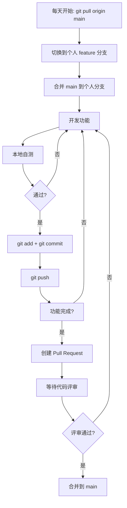

# 各开发者工作方法

> 适用项目：xunfang-ui（基于 RuoYi-Vue / Vue3 + Vite + Element Plus）
> 更新日期：2026-06-27

---

## 目录

1. [通用工作流程](#一通用工作流程)
2. [开发者A — 供应商与采购订单模块](#二开发者a--供应商与采购订单模块案例一)
3. [开发者B — 产品族与产品管理模块](#三开发者b--产品族与产品管理模块案例二)
4. [开发者C — 单位管理与Part管理模块](#四开发者c--单位管理与part管理模块案例三)
5. [Commit 规范速查](#五commit-规范速查)
6. [常见问题处理](#六常见问题处理)

---

## 一、通用工作流程



### 每日开工流程

```bash
# Step 1: 拉取 main 最新代码
git checkout main
git pull origin main

# Step 2: 切回自己的分支
git checkout feature/caseX-xxx

# Step 3: 将 main 的更新合并到自己的分支
git merge main

# Step 4: 开始开发...
```

### 提交与推送流程

```bash
# Step 1: 查看变更
git status

# Step 2: 添加文件（只添加自己案例的文件）
git add <文件路径>

# Step 3: 提交（使用规范前缀）
git commit -m "[案例X] feat: 完成xxx功能"

# Step 4: 推送到远程
git push origin feature/caseX-xxx
```

---

## 二、开发者A — 供应商与采购订单模块（案例一）

### 2.1 负责文件

| 分类 | 文件路径 | 说明 |
|------|---------|------|
| Vue 视图 | `src/views/manufacture/supplier/index.vue` | 供应商列表、查询、新增、修改、删除 |
| Vue 视图 | `src/views/manufacture/purchaseorder/index.vue` | 采购订单列表、查询、新增、修改、删除 |
| API 接口 | `src/api/manufacture/supplier.js` | 供应商 CRUD API |
| API 接口 | `src/api/manufacture/purchaseorder.js` | 采购订单 CRUD API |

### 2.2 分支信息

- **分支名**: `feature/case1-supplier-purchaseorder`
- **首次克隆与切换**:

```bash
git clone https://github.com/K1ng-1016/xunfang-ui.git
cd xunfang-ui
git checkout main
git pull origin main
git checkout -b feature/case1-supplier-purchaseorder origin/feature/case1-supplier-purchaseorder
```

### 2.3 开发步骤

#### 2.3.1 供应商管理

```bash
# 1. 创建目录（如不存在）
mkdir -p src/views/manufacture
mkdir -p src/api/manufacture

# 2. 创建供应商 API 文件
#   编辑 src/api/manufacture/supplier.js
#   内容包括: listSupplier, getSupplier, addSupplier, updateSupplier, delSupplier

# 3. 创建供应商视图文件
#   编辑 src/views/manufacture/supplier/index.vue
#   内容包括: 查询表单、表格展示、分页、新增/编辑弹窗、删除确认

# 4. 提交
git add src/api/manufacture/supplier.js src/views/manufacture/supplier/index.vue
git commit -m "[案例一] feat: 完成供应商管理基础功能"
git push origin feature/case1-supplier-purchaseorder
```

#### 2.3.2 采购订单管理

```bash
# 1. 创建采购订单 API 文件
#   编辑 src/api/manufacture/purchaseorder.js

# 2. 创建采购订单视图文件
#   编辑 src/views/manufacture/purchaseorder/index.vue

# 3. 提交
git add src/api/manufacture/purchaseorder.js src/views/manufacture/purchaseorder/index.vue
git commit -m "[案例一] feat: 完成采购订单管理基础功能"
git push origin feature/case1-supplier-purchaseorder
```

### 2.4 注意事项

- 供应商和采购订单可能存在关联关系，注意在采购订单中选择供应商时调用供应商接口获取数据
- 遵循若依框架的目录规范和代码风格
- 如需新增依赖（如 `package.json`），按共享文件修改流程处理

---

## 三、开发者B — 产品族与产品管理模块（案例二）

### 3.1 负责文件

| 分类 | 文件路径 | 说明 |
|------|---------|------|
| Vue 视图 | `src/views/manufacture/productfamily/index.vue` | 产品族列表、查询、新增、修改、删除 |
| Vue 视图 | `src/views/manufacture/product/index.vue` | 产品列表、查询、新增、修改、删除 |
| API 接口 | `src/api/manufacture/productfamily.js` | 产品族 CRUD API |
| API 接口 | `src/api/manufacture/product.js` | 产品 CRUD API |
| API 接口 | `src/api/manufacture/lifecycle.js` | 产品生命周期状态 API |

### 3.2 分支信息

- **分支名**: `feature/case2-productfamily-product`
- **首次克隆与切换**:

```bash
git clone https://github.com/K1ng-1016/xunfang-ui.git
cd xunfang-ui
git checkout main
git pull origin main
git checkout -b feature/case2-productfamily-product origin/feature/case2-productfamily-product
```

### 3.3 开发步骤

#### 3.3.1 产品族管理

```bash
# 1. 创建目录
mkdir -p src/views/manufacture
mkdir -p src/api/manufacture

# 2. 创建产品族 API 文件
#   编辑 src/api/manufacture/productfamily.js
#   内容包括: listProductFamily, getProductFamily, addProductFamily,
#             updateProductFamily, delProductFamily

# 3. 创建产品族视图文件
#   编辑 src/views/manufacture/productfamily/index.vue
#   内容包括: 查询表单、表格展示、分页、新增/编辑弹窗、删除确认

# 4. 提交
git add src/api/manufacture/productfamily.js src/views/manufacture/productfamily/index.vue
git commit -m "[案例二] feat: 完成产品族管理基础功能"
git push origin feature/case2-productfamily-product
```

#### 3.3.2 产品管理

```bash
# 1. 创建产品 API 文件
#   编辑 src/api/manufacture/product.js

# 2. 创建产品视图文件
#   编辑 src/views/manufacture/product/index.vue

# 3. 提交
git add src/api/manufacture/product.js src/views/manufacture/product/index.vue
git commit -m "[案例二] feat: 完成产品管理基础功能"
git push origin feature/case2-productfamily-product
```

#### 3.3.3 生命周期管理

```bash
# 1. 创建生命周期 API 文件
#   编辑 src/api/manufacture/lifecycle.js

# 2. 提交（生命周期通常嵌入产品管理中使用）
git add src/api/manufacture/lifecycle.js
git commit -m "[案例二] feat: 完成产品生命周期状态管理"
git push origin feature/case2-productfamily-product
```

### 3.4 注意事项

- 产品属于某个产品族，注意在产品的表单中实现产品族的下拉选择
- 生命周期状态可作为产品的扩展属性管理
- 遵循若依框架的目录规范和代码风格

---

## 四、开发者C — 单位管理与Part管理模块（案例三）

### 4.1 负责文件

| 分类 | 文件路径 | 说明 |
|------|---------|------|
| Vue 视图 | `src/views/manufacture/unit/index.vue` | 单位列表、查询、新增、修改、删除 |
| Vue 视图 | `src/views/manufacture/part/index.vue` | Part列表、查询、新增、修改、删除 |
| API 接口 | `src/api/manufacture/unit.js` | 单位 CRUD API |
| API 接口 | `src/api/manufacture/part.js` | Part CRUD API |

### 4.2 分支信息

- **分支名**: `feature/case3-unit-part`
- **首次克隆与切换**:

```bash
git clone https://github.com/K1ng-1016/xunfang-ui.git
cd xunfang-ui
git checkout main
git pull origin main
git checkout -b feature/case3-unit-part origin/feature/case3-unit-part
```

### 4.3 开发步骤

#### 4.3.1 单位管理

```bash
# 1. 创建目录
mkdir -p src/views/manufacture
mkdir -p src/api/manufacture

# 2. 创建单位 API 文件
#   编辑 src/api/manufacture/unit.js
#   内容包括: listUnit, getUnit, addUnit, updateUnit, delUnit

# 3. 创建单位视图文件
#   编辑 src/views/manufacture/unit/index.vue
#   内容包括: 查询表单、表格展示、分页、新增/编辑弹窗、删除确认

# 4. 提交
git add src/api/manufacture/unit.js src/views/manufacture/unit/index.vue
git commit -m "[案例三] feat: 完成单位管理基础功能"
git push origin feature/case3-unit-part
```

#### 4.3.2 Part管理

```bash
# 1. 创建 Part API 文件
#   编辑 src/api/manufacture/part.js

# 2. 创建 Part 视图文件
#   编辑 src/views/manufacture/part/index.vue

# 3. 提交
git add src/api/manufacture/part.js src/views/manufacture/part/index.vue
git commit -m "[案例三] feat: 完成Part管理基础功能"
git push origin feature/case3-unit-part
```

### 4.4 注意事项

- 如果需要在 Part 中选择单位，请调用 Unit 的接口获取单位列表
- 使用 `src/utils/download.js` 中的 `downloadByStream` 方法（已存在，无需修改）
- 遵循若依框架的目录规范和代码风格

---

## 五、Commit 规范速查

### 前缀规则

| 前缀 | 适用场景 | 示例 |
|------|---------|------|
| `[案例一]` | 开发者A的提交 | `[案例一] feat: 完成供应商查询功能` |
| `[案例二]` | 开发者B的提交 | `[案例二] feat: 完成产品族新增功能` |
| `[案例三]` | 开发者C的提交 | `[案例三] feat: 完成单位批量删除` |
| `chore` | 共享文件修改 | `chore: 添加element-plus依赖` |

### 类型标识

| 类型 | 说明 |
|------|------|
| `feat` | 新功能 |
| `fix` | 修复 |
| `refactor` | 重构 |
| `style` | 样式修改 |
| `docs` | 文档 |
| `chore` | 构建/工具/依赖 |

### 完整示例

```bash
git commit -m "[案例一] feat: 完成供应商查询与分页功能"
git commit -m "[案例一] feat: 完成供应商新增/修改弹窗"
git commit -m "[案例一] fix: 修复供应商搜索时状态不对的问题"
git commit -m "[案例二] feat: 完成产品族生命周期管理"
git commit -m "[案例三] feat: 完成单位批量新增功能"
git commit -m "[案例三] feat: 完成Part文件上传功能"
```

---

## 六、常见问题处理

### 6.1 合并冲突

```bash
# 如果 git merge main 时出现冲突
# 1. 确认冲突文件归属
# 2. 如果是自己的文件 → 手动解决冲突
# 3. 如果是他人的文件 → 联系对应开发者解决
# 4. 解决后标记并提交
git add <已解决冲突的文件>
git commit -m "[案例X] fix: 解决与 main 的合并冲突"
```

### 6.2 推送被拒绝

```bash
# 如果 git push 失败提示 non-fast-forward
# 说明远程有他人提交，需要先拉取合并
git pull origin feature/caseX-xxx
# 解决可能的冲突后
git push origin feature/caseX-xxx
```

### 6.3 误修改了他人文件

如果不小心修改了不属于自己案例的文件：

```bash
# 方案一：放弃该文件的修改
git checkout -- <他人文件路径>

# 方案二：如果已提交，联系项目负责人回退
```

### 6.4 需要修改共享文件

如需修改 `package.json`、`src/utils/` 等共享文件：

```bash
# 1. 通知项目负责人
# 2. 由负责人在 main 上单独开 chore 分支修改
# 3. 合并到 main 后通知所有人拉取
git checkout main
git pull origin main
# 如有 package.json 变更，执行 npm install
git checkout feature/caseX-xxx
git merge main
```

---

## 附录：项目初始化骨架目录

```bash
# 确保以下目录存在（各开发者首次开发前执行）
mkdir -p src/views/manufacture/supplier
mkdir -p src/views/manufacture/purchaseorder
mkdir -p src/views/manufacture/productfamily
mkdir -p src/views/manufacture/product
mkdir -p src/views/manufacture/unit
mkdir -p src/views/manufacture/part
mkdir -p src/api/manufacture
```
