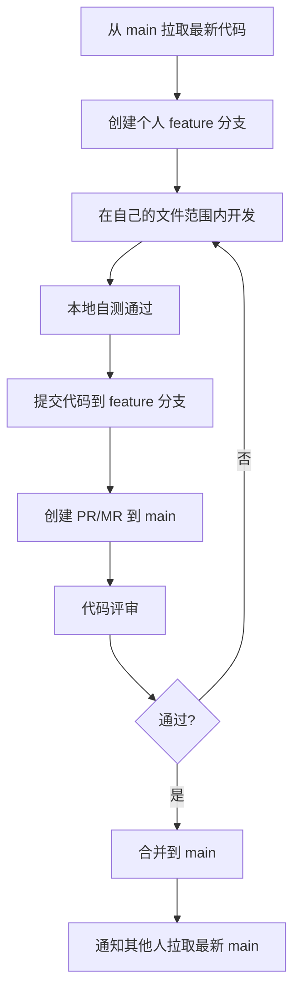

# 多人协作开发方案

> 适用项目：xunfang-ui（基于 RuoYi-Vue / Vue3 + Vite + Element Plus）
> 更新日期：2026-06-27

---

## 一、冲突分析结论

| 冲突类型 | 是否冲突 | 说明 |
|----------|---------|------|
| `src/views/manufacture/` 下的 Vue 文件 | ✅ 无冲突 | 各案例文件名完全不同 |
| `src/api/manufacture/` 下的 API 文件 | ✅ 无冲突 | 各案例文件名完全不同 |
| 路由配置 | ✅ 无冲突 | 若依框架通过后端菜单管理动态加载路由 |
| `src/utils/download.js` | ✅ 无需修改 | 案例三需要的 `downloadByStream` 已存在 |
| `package.json` | ⚠️ 潜在冲突 | 如需新增依赖才可能冲突 |

---

## 二、文件归属矩阵

每个开发者**只允许**在自己的文件范围内操作：

### 案例一：供应商与采购订单模块（开发者A）

```
src/views/manufacture/supplier/index.vue
src/views/manufacture/purchaseorder/index.vue
src/api/manufacture/supplier.js
src/api/manufacture/purchaseorder.js
```

### 案例二：产品族与产品管理（开发者B）

```
src/views/manufacture/productfamily/index.vue
src/views/manufacture/product/index.vue
src/api/manufacture/productfamily.js
src/api/manufacture/product.js
src/api/manufacture/lifecycle.js
```

### 案例三：单位管理与Part管理（开发者C）

```
src/views/manufacture/unit/index.vue
src/views/manufacture/part/index.vue
src/api/manufacture/unit.js
src/api/manufacture/part.js
```

---

## 三、Git 分支策略

```
main ──────────────────────────────────────────►
  │
  ├── feature/case1-supplier-purchaseorder ────►  (开发者A)
  ├── feature/case2-productfamily-product ─────►  (开发者B)
  └── feature/case3-unit-part ─────────────────►  (开发者C)
```

### 初始化步骤（项目负责人执行一次）

```bash
# 创建共享目录骨架（Git 不追踪空目录，创建占位文件确保目录存在）
mkdir -p src/views/manufacture
mkdir -p src/api/manufacture
```

### 各开发者启动流程

```bash
# 1. 拉取最新 main
git checkout main
git pull origin main

# 2. 创建个人 feature 分支
git checkout -b feature/case1-supplier-purchaseorder   # 开发者A
git checkout -b feature/case2-productfamily-product     # 开发者B
git checkout -b feature/case3-unit-part                 # 开发者C

# 3. 开始开发...
```

---

## 四、开发流程



---

## 五、关键规则（铁律）

| 序号 | 规则 | 说明 |
|------|------|------|
| 1 | **文件锁定** | 每人只编辑自己案例的文件，绝不触碰他人文件 |
| 2 | **禁止修改共享文件** | `src/utils/`、`src/router/`、`src/store/`、`src/components/` 等共享目录，如需修改必须先协商 |
| 3 | **Daily Sync** | 每天开始工作前从 `main` 拉取最新代码 |
| 4 | **小步提交** | 每完成一个子功能就 commit，避免积压大量变更 |
| 5 | **Commit 规范** | 使用 `[案例一]`、`[案例二]`、`[案例三]` 前缀标识提交来源 |

### Commit 示例

```bash
git commit -m "[案例一] feat: 完成供应商查询与分页功能"
git commit -m "[案例一] feat: 完成供应商新增/修改弹窗"
git commit -m "[案例二] feat: 完成产品族生命周期管理"
git commit -m "[案例三] feat: 完成单位批量新增功能"
```

---

## 六、共享文件修改流程

如果确实需要修改共享文件（如 `package.json` 新增依赖），按以下流程处理：

```bash
# 1. 单独开一个 chore 分支
git checkout main
git checkout -b chore/add-dependency-xxx

# 2. 修改共享文件
# 编辑 package.json 等

# 3. 提交
git add package.json
git commit -m "chore: 添加 xxx 依赖"

# 4. 推送到远程并创建 PR
git push origin chore/add-dependency-xxx

# 5. 合并到 main 后，通知所有人拉取并 npm install
```

其他人同步：

```bash
git checkout main
git pull origin main
npm install
git checkout feature/caseX-xxx
git merge main   # 将共享变更合并到自己的分支
```

---

## 七、冲突兜底预案

万一出现合并冲突（正常情况下不会发生）：

| 步骤 | 操作 |
|------|------|
| 1 | 确认冲突文件归属哪个案例 |
| 2 | 文件所有者负责解决冲突 |
| 3 | **非所有者不得自行解决他人文件的冲突** |
| 4 | 解决后双方确认再合并 |

---

## 八、CODEOWNERS（可选增强）

在项目根目录创建 `.github/CODEOWNERS`（GitHub）或在 GitLab 项目设置中配置：

```
# 案例一
src/views/manufacture/supplier/          @developerA
src/views/manufacture/purchaseorder/     @developerA
src/api/manufacture/supplier.js          @developerA
src/api/manufacture/purchaseorder.js     @developerA

# 案例二
src/views/manufacture/productfamily/     @developerB
src/views/manufacture/product/           @developerB
src/api/manufacture/productfamily.js     @developerB
src/api/manufacture/product.js           @developerB
src/api/manufacture/lifecycle.js         @developerB

# 案例三
src/views/manufacture/unit/              @developerC
src/views/manufacture/part/              @developerC
src/api/manufacture/unit.js              @developerC
src/api/manufacture/part.js              @developerC
```

> 配置后 PR 会自动指派对应文件的负责人进行代码评审。

---

## 九、总结

> **核心结论：当前项目架构已经天然支持多人并行开发。**
>
> 三个案例的文件路径和文件名完全不重叠，只要每人遵守"只编辑自己案例文件"的铁律，就不会产生任何代码冲突。
>
> 唯一需要协调的场景：共享文件（如 `package.json`）修改 → 通过独立 chore 分支先合入 main → 其他人拉取同步。
